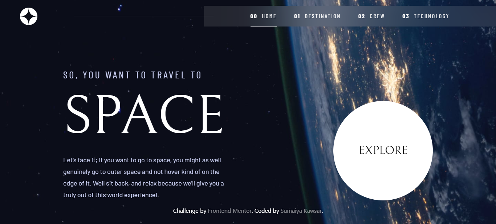

# Frontend Mentor - Space tourism website solution

  <h3>
    <a href="https://sumaiyakawsar.github.io/space-tourism-website/">
      Demo
    </a>
     | 
    <a href="https://github.com/sumaiyakawsar/space-tourism-website">
      Solution
    </a>
     | 
    <a href="https://www.frontendmentor.io/challenges/space-tourism-multipage-website-gRWj1URZ3">
      Challenge
    </a>
  </h3>

## Overview

### The challenge

Users should be able to:

- View the optimal layout for each of the website's pages depending on their device's screen size
- See hover states for all interactive elements on the page
- View each page and be able to toggle between the tabs to see new information

 

### Screenshot

### Built with

- [React](https://reactjs.org/) 
- [Tailswind](https://tailwindcss.com/?)
- CSS Flex 
- Mobile-first workflow

## My process
 
### What I learned

- Properly use react-router-dom

### Continued development
- Add Animation/Motion next

### Useful resources

- [Responsive Navigation using tailwind](https://www.youtube.com/watch?v=hJ6-blTSNmE) - This youtube video has helped me to create a proper navigation for mobile using tailwind

## Author

 
